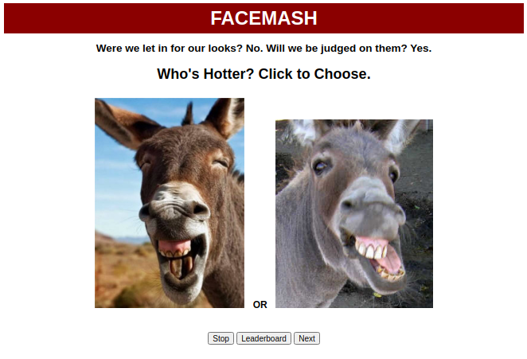
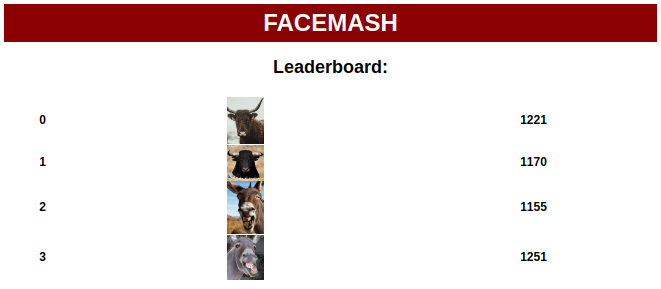

# FaceMash
A Remake of Mark Zuckerberg's application of the same name

This one's written purely in JS and makes use of the local DB to store ELO ratings. It's something I hacked up over a Sunday afternoon for some fun. My JS Sucks and this needs multiple refactorings + some server side code to be a good application.

P.S: Provide your own images and store them in the img/guys and img/gals folder.

